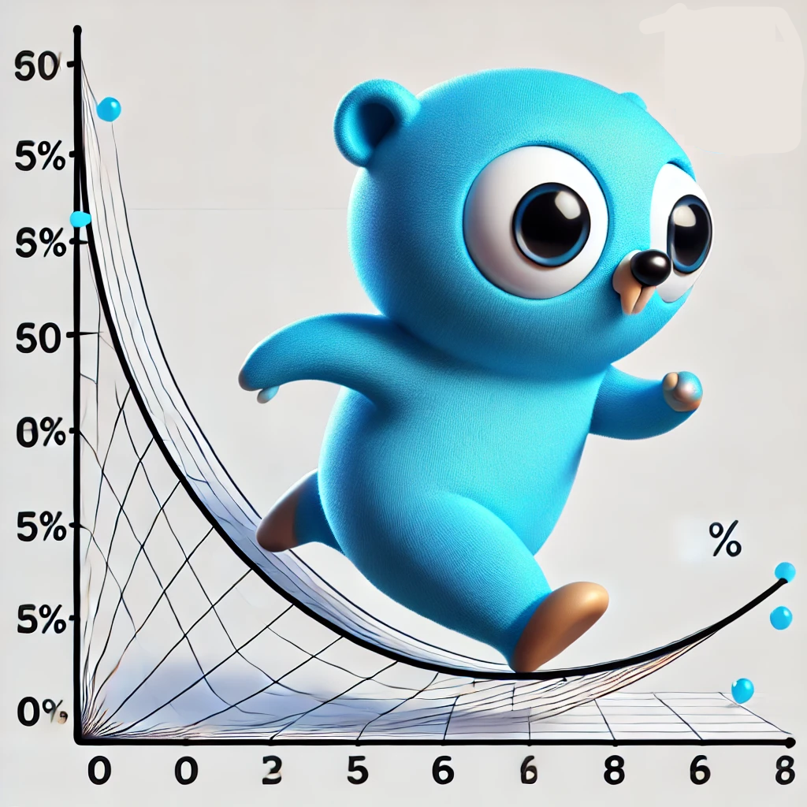

# GoGrad 
&middot; 
[](https://pkg.go.dev/github.com/daniel4x/GoGrad) 
[](https://github.com/daniel4x/GoGrad/actions/workflows/go.yml)
[](https://goreportcard.com/report/github.com/daniel4x/GoGrad)
[](LICENSE)

<p align="center">
  
</p>

> **Educational Project** – Implementing computational graphs and backpropagation in Go, inspired by [micrograd](https://github.com/karpathy/micrograd) & [nn-zero-to-hero](https://github.com/karpathy/nn-zero-to-hero) by Andrej Karpathy.

---

## Table of Contents

1. [Introduction](#introduction)  
2. [Motivation](#motivation)  
3. [Features](#features)  
4. [Quick Start](#quick-start)  
5. [Example: Training a Tiny Network](#example-training-a-tiny-network)  
6. [Running Tests](#running-tests)  
7. [Contributing](#contributing)  
8. [License](#license)

---

## Introduction
**GoGrad** is a minimal Go-based library for experimenting with computational graphs and automated differentiation (backprop). The goal is to provide a simple, readable codebase for learning how backpropagation actually works under the hood—**no heavy frameworks required**.

You’ll find:
- A `Value` struct that tracks data, gradients, and the relationships between nodes in the graph.  
- Basic ops (add, mul, pow, tanh, etc.) with corresponding backward passes.  
- A small feedforward neural net (MLP) implementation with multiple layers, each composed of neurons.

> **Disclaimer**: This is **not** intended to be a production-grade deep learning framework. It's purely educational, focusing on the core backprop mechanics and a pinch of “neural net flavor”.

---

## Motivation
Why implement yet another deep learning library in Golang?  
- **Hands-On Learning**: Implementing backprop from scratch is the best way to master how neural nets really work.  
- **Go Ecosystem**: Go is known for simplicity, concurrency, and robust tooling. It’s a fun place to explore ML fundamentals without overhead.  
- **Personal Growth**: I needed to learn Go for work and wanted to do something more interesting than “Hello, World!”  

---

## Features
- **Core Autograd Engine**  
  - A `Value` type that stores `data`, `grad`, and function references for backward propagation.
  - Support for basic math ops: `+`, `-`, `*`, `/`, `Pow`, `Tanh`, etc.

- **Multi-Layer Perceptron**  
  - A minimal feedforward neural network (`MLP`) built on top of the `Value` nodes.
  - Forward and backward passes with everything you need for small-scale toy problems.

- **Tests**  
  - Includes unit tests verifying correctness of the gradient computations against numerical approximations.

---

## Quick Start
1. **Clone the repo**:
   ```bash
   git clone https://github.com/daniel4x/gograd.git
   cd gograd
   ```
2. **Run tests** (verifies everything is working):
   ```bash
   go test ./engine -v
   ```
3. **Use it in your own code** (if you like):
   ```go
   go get github.com/daniel4x/gograd
   ```
   Then import in your project:
   ```go
   import (
       "github.com/daniel4x/gograd/engine"
   )
   ```

---

## Example: Training a Tiny Network

Here’s a minimal code snippet you can run to see “learning” in action:

```go
package main

import (
    "fmt"
    "github.com/daniel4x/gograd/engine"
)

func main() {
    // 1) Define a small MLP (3 inputs -> [4,4] hidden layers -> 1 output)
    nn := engine.NewMLP(3, []int{4, 4, 1})

    // 2) Prepare a tiny dataset (XOR-ish or similar)
    //    For example, we have 4 examples of (x1, x2, x3) -> y
    xData := [][]float64{
        {2.0,  3.0, -1.0},
        {3.0, -1.0,  0.5},
        {0.5,  1.0,  1.0},
        {1.0,  1.0, -1.0},
    }
    yData := []float64{ 1, -1, -1, 1 }

    // Convert xData to Value slices
    xVals := makeValueMatrix(xData)

    // 3) Train loop
    epochs := 50
    lr := 0.05
    for e := 0; e < epochs; e++ {
        // Forward pass: compute predictions and total loss
        var loss *engine.Value
        for i := 0; i < len(xVals); i++ {
            pred := nn.Call(xVals[i])
            diff := pred.Sub(yData[i]).Pow(2) // (pred - y)^2
            if i == 0 {
                loss = diff
            } else {
                loss = loss.Add(diff)
            }
        }

        // Zero out gradients
        for _, p := range nn.Parameters() {
            p.Grad = 0
        }

        // Backprop
        loss.Backward()

        // Gradient descent step
        for _, p := range nn.Parameters() {
            p.Data -= lr * p.Grad
        }

        fmt.Printf("Epoch %d - Loss: %.4f\n", e, loss.Data)
    }

    // 4) Final predictions
    fmt.Println("\nFinal Predictions:")
    for i := 0; i < len(xVals); i++ {
        pred := nn.Call(xVals[i])
        fmt.Printf("x: %v, y: %.2f, pred: %.4f\n", xData[i], yData[i], pred.Data)
    }
}
```

**Output**: You should see the loss drop and the final predictions approaching the target `y` values.

---

## Running Tests
All engine tests live under the `engine` package. To run them:
```bash
go test ./engine -v
```
- `-v` (verbose) will print each test case’s progress and show you iteration-by-iteration logs in certain tests.

---

## Contributing
Whether you’re learning Go or backprop, contributions are welcome! Here’s how to get started:

1. **Fork & Clone**:  
   ```bash
   git clone https://github.com/daniel4x/gograd.git
   ```
2. **Pick an Issue**: Look for [good first issue](https://github.com/daniel4x/gograd/labels/good%20first%20issue) or [help wanted](https://github.com/daniel4x/gograd/labels/help%20wanted) labels.
3. **Create a Branch**:  
   ```bash
   git checkout -b my-new-feature
   ```
4. **Open a Pull Request**: Provide a clear description of what you’ve changed or added.

**Ways to contribute**:
- Implement new math ops (sigmoid, ReLU, etc.).
- Add an example project (like the XOR problem).
- Improve docs and code comments for clarity or best practices.

---

## License
This project is licensed under the [MIT License](LICENSE). Feel free to use it for learning and research.

---

<p align="center">
  Made with ❤️ & Go.
</p>

---

**Happy Learning and Hacking!**  
If you find this project interesting or educational, consider giving it a ⭐ on GitHub.  